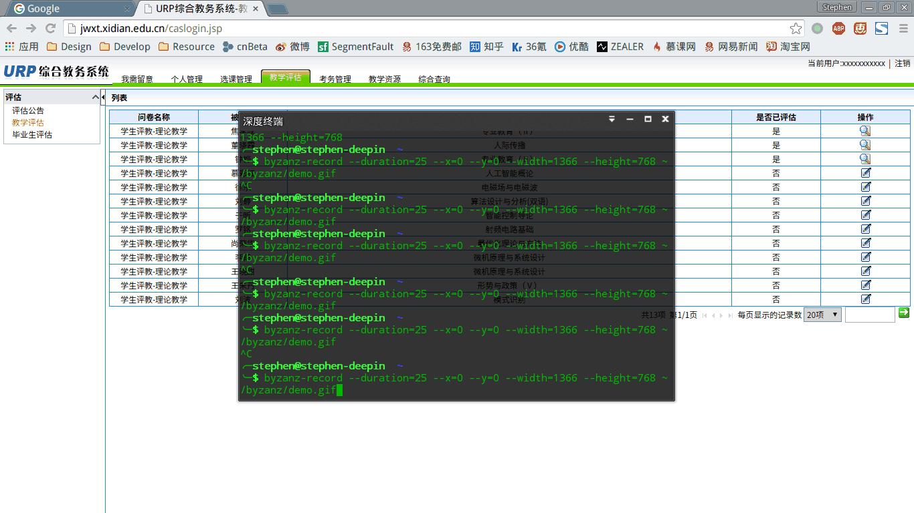

# 西电教学评估速选器

### 更新

隔了一年多了，一直打算把这个插件再完善一下,这不花了点时间重构了一下。这次更新使大家可以在`教学评估列表页（就是那个有很多老师的页面）`一键进行评教了。

> 但是你必须在每次评教完成弹出**评估完成**时**按一下回车**，这点让强迫症很难受啊（逃

### 前言

这几天又要进行教学评估了，本来吧可能出于“*为了教学质量* ”这种神圣重要而高贵的目的(姑且这么认为吧 :))，但是但是你网站做得那么搓就是你的错了。选一个老师的按钮那么小，你是要谁点；选优良中的按钮那么小，你是要谁点，关键是只能点 `radio`，点击文字却是没有用的，这就让人忍不了了。作为一个前端工程师，怎么能够忍受这种“奇耻大辱”，于是决定试一试，没想到还真成功了，也就方便了许多。

### 快速开始

如果你只是想要快速进行教学评估而不想使用插件的话，可以在浏览器中按下 `F12` 打开控制台，输入下面这段代码并按下**回车**，你会发现一切都会自动进行。记得要在 `教学评估列表页（就是那个有很多老师的页面）`呦。

> 但是你必须在每次评教完成弹出**评估完成**时**按一下回车**，这点让强迫症很难受啊（逃

```javascript
var CONFIG = {
  optionsRate: [8, 1, 0, 0],  // 每次评教的四个选项的比例
  comments: [  // 主观评价，评价时会随机选择
    '课程内容很充实，教师教学很风趣。',
    '不够有趣',
    '老师很好！教得贼棒了!',
    '不错不错',
    '好老师',
    '真是一门好课啊！很喜欢呢~',
    '希望加油！'
  ]
}

start()

// 开始脚本
function start(data) {
  evaluateAuto()
  window.frames['bottomFrame'].document.querySelector('[name=mainFrame]').onload = evaluateAuto
}

// 自动评教
function evaluateAuto () {
  var mainFrame = window.frames['bottomFrame'].frames['mainFrame']
  var btnEle = mainFrame.document.querySelector('img[title=评估]')

  if(mainFrame.document.querySelectorAll('.fieldsettop .titleTop3')[1]) { // 评教页
    evaluate(mainFrame)
  } else if (btnEle) {  // 列表页
    btnEle.click()
  } else if(mainFrame.document.querySelector('img[title=查看]')) {
    window.frames['bottomFrame'].document.querySelector('[name=mainFrame]').onload = null
    alert('已全部评教')
  } else {
    window.frames['bottomFrame'].document.querySelector('[name=mainFrame]').onload = null
    console.log('请在教学评估页使用')
  }
}

// 评教
function evaluate (mainFrame) {
  var comment = CONFIG.comments[parseInt(Math.random() * CONFIG.comments.length)]
  var optionsRate = CONFIG.optionsRate

  // 所有选项 Node
  var optionsEles = mainFrame.document.querySelectorAll('.fieldsettop .titleTop3')[1].querySelectorAll('#tblView table tr:nth-child(even) > td')

  // 主观评价 Node
  var subjectiveEles = [optionsEles[optionsEles.length - 1].querySelector('textarea'), mainFrame.document.querySelectorAll('.fieldsettop .titleTop3')[2].querySelector('textarea')]

  // 提交 Node
  var submitBtn = mainFrame.document.querySelector('[title=提交]')

  // 随机选择
  for(var i = 0, optionIndex = 0; i < optionsEles.length - 1; i++) {
    optionIndex = getRandomOption(optionsRate)
    optionsEles[i].querySelectorAll('input')[optionIndex].checked = true
  }

  // 填充主观评价
  commentsFill(subjectiveEles, comment)

  // 提交评价
  submitBtn.click()
}

// 按照比例获取随机选项
function getRandomOption (optionsRate) {
  optionsRate = optionsRate || [1, 1, 1, 1]
  var rateSum, random, index, sum, i;

  for(i = 0, rateSum = 0; i < optionsRate.length; i++) {
    rateSum += parseInt(optionsRate[i])
  }

  random = Math.ceil(Math.random() * rateSum)

  for(i = 0, sum = 0; i < optionsRate.length; i++) {
    sum += optionsRate[i]
    if(random <= sum) {
      return i
    }
  }

  return 0
}

// 填充评论框
function commentsFill (eles, comment) {
	for(var i = 0; i < eles.length; i++) {
    eles[i].value = comment
  }
  return i
}
```

### 插件

插件已更新，部分与截图显示不一致。



### 获取
[Chrome 应用商店](https://chrome.google.com/webstore/detail/xd-teaching-evaluator/ckdjifnhhfpmeojmgbibbfooeomnpmgi?hl=zh-CN&gl=TW)

[百度云盘](http://pan.baidu.com/s/1i5FDxbf)

### 使用
如果你不是从 Chrome 应用商店下载的话，由于 Chrome 目前禁止第三方插件的安装，所以你需要在 Chrome 里依次点击 `菜单` `更多工具` `扩展程序` 然后打开 `开发者模式`，将插件拖进来然后会自动安装。
