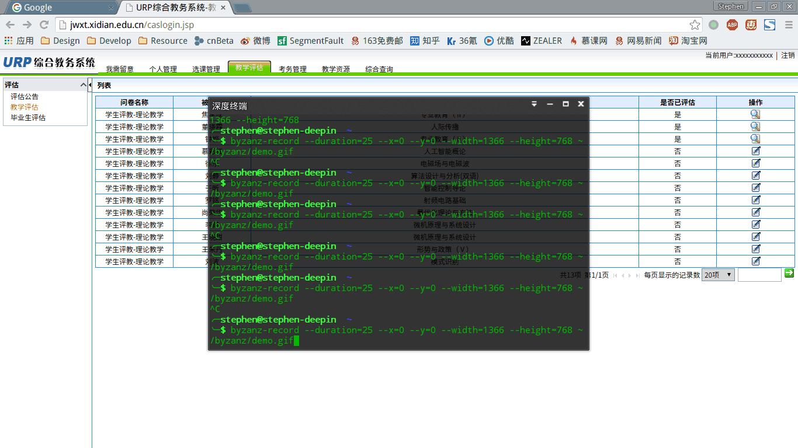

# 西电教学评估速选器
### 前言
这几天又要进行教学评估了，本来吧可能出于“*为了教学质量* ”这种神圣重要而高贵的目的(姑且这么认为吧 :))，但是但是你网站做得那么搓就是你的错了。选一个老师的按钮那么小，你是要谁点；选优良中的按钮那么小，你是要谁点，关键是只能点 `radio`，点击文字却是没有用的，这就让人忍不了了。作为一个前端工程师，怎么能够忍受这种“奇耻大辱”，于是决定试一试，没想到还真成功了，也就方便了许多。

PS. 不要问我代码质量为什么这么搓我是不会告诉你这是上个学期用了几个小时从压根没有接触过 Chrome 插件开发到开发成功的后来也就懒得改了（逃。

### 快速开始
如果你只是想要快速进行教学评估而不想使用插件或是不想知道原理的话，可以在控制台里执行下面这段代码，你会发现问卷已经自动填写完整，甚至自动提交。

```javascript
var radios = window.frames['bottomFrame'].frames['mainFrame'].document.getElementsByTagName('table')[4].getElementsByTagName('table')[6].getElementsByTagName('table')[0].getElementsByTagName('input');
var textArea = window.frames['bottomFrame'].frames['mainFrame'].document.getElementsByTagName('textarea');
var buttons = window.frames['bottomFrame'].frames['mainFrame'].document.getElementsByTagName('img');

for(var i in radios) {
  if (/^[0-9.]{1,}_1$/.test(radios[i].value) && !radios[i].checked) {
    radios[i].checked = true;
  }
};

textArea[0].value = '很好！';
textArea[1].value = '很好！';

// 你可以取消下面这段注释，这样在速选之后还能自动提交
/*for (var i in buttons) {
  if (buttons[i].title == "提交") {
    buttons[i].click();
  }
}*/
```

### 插件



### 获取
[点这里下载插件](http://puyart.net/static/damn-jwxt.crx)

### 使用
由于 Chrome 目前禁止第三方插件的安装，所以你需要在 Chrome 里依次点击 `菜单` `更多工具` `扩展程序` 然后打开 `开发者模式`，将插件拖进来然后会自动安装。

进入 **问卷评估** 页，点击那个 luffy 的头像，打开插件。你可以填选优良中的比例和评价内容，点击 *pikachuu* 即可。过程正如上图。
